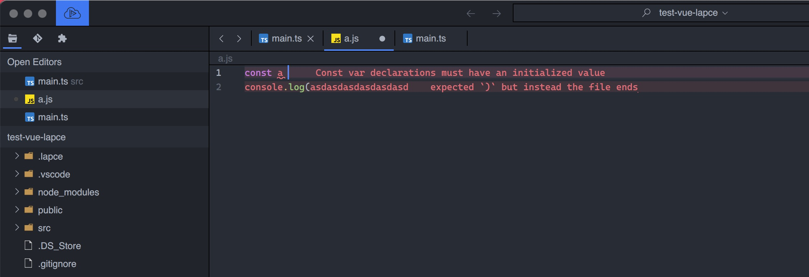

# Lapce Plugin for [Rome](https://github.com/rome/tools/) 

Lapce-rome is a Lapce plugin for rome, The Rome is faster⚡ , A formatter, linter, compiler, bundler, and more for JavaScript, TypeScript, HTML, Markdown, and CSS. 

### js linter Preview

### Usage

> Require: Lapce version must Greater than 2.0, you can use Lapce nightly version. [click hear get new version](https://github.com/lapce/lapce/releases)

****

**Installed through the plugin market**

Open Lapce(need version > 2.0) and click plugin icon, then find Lapce-rome plugin ,click install.

**Manual installation**

1. Open Lapce， Press F1 button, input `:open plugins Directory` 
2. download `lapce-rome.tar.gz` [click hare get release](https://github.com/xiaoxin-sky/lapce-rome/releases)
3. reload Lapce
