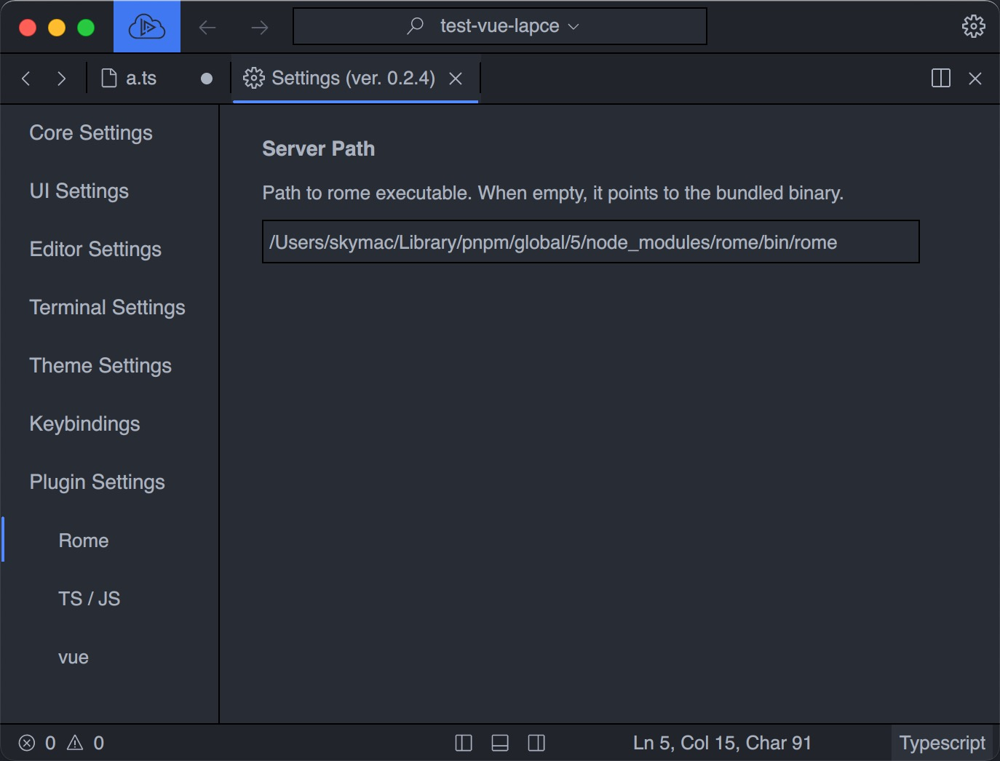

<div align=center></div>

# Lapce Plugin for [Rome](https://github.com/rome/tools/) 

Lapce-rome is a Lapce plugin for rome, The Rome is faster⚡ , A formatter, linter, compiler, bundler, and more for JavaScript, TypeScript, HTML, Markdown, and CSS. 

### Rome linter and format Preview


### Usage

**Config language server path**
> if download language Binary slow, You can set language server.
> you need install rome first, and Paste the npm global rome bin to lapce rome config setting.  

install global vue language server
```bash
npm install rome -g
```

